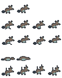
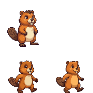
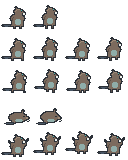
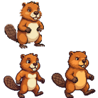
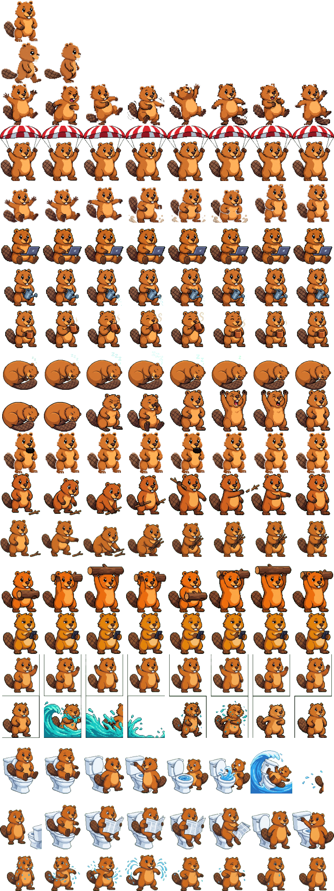
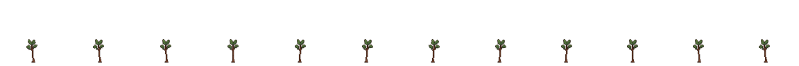
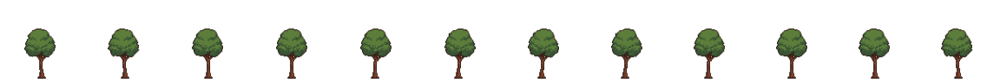
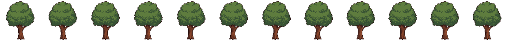
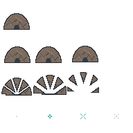

# Asset Gallery — figures & animation library

The catalog of every figure/avatar and animation asset in Beaver Buddy: what
exists, where it lives, its animation set, and its provenance. **Every new
figure or animation must be registered here** — this file is the library index.

Style rules and full provenance details: [`assets/STYLE.md`](../assets/STYLE.md).
ComfyUI generation pipeline: [`comfyui-avatar-generation.md`](comfyui-avatar-generation.md).

## Storage convention

- Committed sheets live in `assets/sprites/` as `<figure>.png` + a companion
  `<figure>.json` row manifest (`tile`, `fps` hint, `sheetWidth`/`sheetHeight`,
  `rows: [{ name, frames }]` — one animation per row, frames left to right,
  transparent padding after short rows).
- All frames are authored **right-facing**; the renderer mirrors horizontally
  for left-facing movement — left-facing source frames are never mixed in.
- Rig-ready character parts (`assets-src/parts/<figure>/`) and curated
  reference images (`assets-src/reference/`) are committed as source assets.
  Raw ComfyUI dumps (`assets-src/comfyui/`) and pre-review bake output
  (`assets-src/baked/`) stay gitignored — only assets that are actually used
  get committed.
- The renderer loads sheets via `loadSheet`/`loadLodgeSheet` in
  `src/renderer/sprites.ts` (plain canvas `drawImage`, no sprite library).

## Figures

### Beaver — baby

- **Files:** `assets/sprites/beaver-baby.png` + `.json` — 768×480 sheet, 96×96
  tiles, fps hint 8
- **Animations:** `idle` (1), `walk` (2), `struggle` (8), `parachute-wind`
  (8), `land` (8)
- **Provenance:** `idle`/`walk` are user-generated art, ingested via
  `scripts/gen-sprites/ingest-images.mjs` (BL-11); colors ship as generated
  (palette rule waived by owner decision — see STYLE.md). `struggle`/
  `parachute-wind`/`land` are appended via
  `scripts/gen-sprites/ingest-animation-frames.mjs baby` (`npm run
  assets:parachute`, BL-17) for the parachute-drop sequence.
- **Status:** final

### Beaver — young baby

- **Files:** `assets/sprites/beaver-young-baby.png` + `.json` — 192×192
  sheet, 96×96 tiles, fps hint 8
- **Animations:** `idle` (1 frame), `walk` (2 frames)
- **Provenance:** full-frame Comfy Cloud generation (`vertexai/nano-banana-2`
  via `partner_generate`), dual reference-conditioned on the committed baby +
  teen idle tiles (base64 data-URI images) so it reads BETWEEN them,
  `targetContentHeightPx: 76`. Ingested via
  `scripts/gen-sprites/ingest-images.mjs` (`npm run assets:young-baby`,
  BL-6/T1). See STYLE.md for full provenance.
- **Status:** committed, not yet wired into `Stage`/`stageForLevel` (WAVE-2)

### Beaver — teen

- **Files:** `assets/sprites/beaver-teen.png` + `.json` — 192×192 sheet, 96×96
  tiles, fps hint 8
- **Animations:** `idle` (1 frame), `walk` (2 frames)
- **Provenance:** user-generated art, ingested via
  `scripts/gen-sprites/ingest-images.mjs` (BL-11)
- **Status:** final

### Beaver — older teen

- **Files:** `assets/sprites/beaver-older-teen.png` + `.json` — 192×192
  sheet, 96×96 tiles, fps hint 8
- **Animations:** `idle` (1 frame), `walk` (2 frames)
- **Provenance:** full-frame Comfy Cloud generation (`vertexai/nano-banana-2`
  via `partner_generate`), dual reference-conditioned on the committed teen +
  adult idle tiles (base64 data-URI images) so it reads BETWEEN them,
  `targetContentHeightPx: 94`. Ingested via
  `scripts/gen-sprites/ingest-images.mjs` (`npm run assets:older-teen`,
  BL-6/T2). See STYLE.md for full provenance.
- **Status:** committed, not yet wired into `Stage`/`stageForLevel` (WAVE-2)

### Beaver — adult

- **Files:** `assets/sprites/beaver-adult.png` + `.json` — 768×2048 sheet,
  96×96 tiles (`exercise`, `parachute-wind`, `toilet`, and `toilet-read` are
  128px-tall rows),
  fps hint 8
- **Animations:** `idle` (1), `walk` (2), `struggle` (8), `parachute-wind`
  (8), `land` (8), `type` (8), `watering` (8), `drink` (8), `sleep` (8),
  `stretch` (8, ONE-SHOT wake-up transition, not a loop), `speak` (8,
  forward-facing talking loop, mouth cycling open/closed), `throw-stick` (8,
  ONE-SHOT, picks up and throws a stick, settles back toward idle),
  `collect-sticks` (8, ONE-SHOT, gathers 2-3 sticks into a bundle, ends
  holding the bundle — an intentionally non-idle end pose), `exercise` (8,
  LOOP, lifts a short log overhead like a dumbbell, two full reps),
  `brainrot` (8, LOOP, glazed phone-scroll, thumb flick), `wave` (8, LOOP,
  friendly wave-goodbye), `flush` (8, ONE-SHOT, stylized toilet-flush gag),
  `toilet` (8, ONE-SHOT, 128px-tall, full toilet routine — sits on a stylized
  toilet, flushes, then a tile-scale wave sweeps toilet + beaver away),
  `toilet-read` (8, ONE-SHOT, 128px-tall, sit + newspaper read beat — chained
  at runtime with flush/wave/shake-dry), `shake-dry` (8, ONE-SHOT, wet shake
  after wave carry-back)
- **Provenance:** `idle`/`walk` are the **side-profile walk cycle + matching
  idle** shipped through 2026-07-21, RESTORED by owner revert (2026-07-23).
  BL-6/T3 had briefly promoted these rows to reference-conditioned Comfy Cloud
  Nano Banana Pro (`GeminiImage2Node`) "final art" (a more front-facing idle +
  a near-static front-facing walk), but owner review reverted both rows — the
  front-facing walk didn't read as walking. The committed tiles are again the
  pre-BL-6 art, pinned by an unconditional committed-sheet byte-pin test
  (`ingest-animation-frames.test.ts`) so CI fails if a placeholder/re-bake ever
  clobbers them; the `adult-idle`/`adult-walk` ingest configs are kept but
  DORMANT (their Comfy source dumps are gone). Do NOT re-run
  `npm run assets:adult-placeholder` against the committed sheet (see
  STYLE.md). `struggle`/`parachute-wind`/`land` appended via
  `scripts/gen-sprites/ingest-animation-frames.mjs adult` (`npm run
  assets:adult-anims`); `type` appended via `scripts/gen-sprites/ingest-typing.mjs`
  (`npm run assets:typing`); `watering`, `drink`, `sleep`, and `stretch`
  appended via `scripts/gen-sprites/ingest-animation-frames.mjs adult-watering` /
  `adult-drink` / `adult-sleep` / `adult-stretch` (`npm run
  assets:adult-watering` BL-1/T2, `npm run assets:adult-drink` BL-3, `npm run
  assets:adult-sleep` BL-4, `npm run assets:adult-stretch` BL-5) — all four
  share the config-driven `buildAdultRowSheet` builder — Comfy Cloud Nano
  Banana, reference-conditioned on the committed adult sprite, green
  chroma-key background. `sleep` is a curled-up idle loop (no settle
  transition) with a committed BL-5 handoff reference tile at
  `assets-src/reference/adult-sleep-pose.png` (frame 8 of 8, fewest zzz
  wisps). `stretch` wakes up from that same sleep-pose tile (dual
  reference-conditioned on it AND the adult idle tile) and settles back to
  the idle stance. `speak` (BL-7) is appended via
  `scripts/gen-sprites/ingest-animation-frames.mjs adult-speak`
  (`npm run assets:adult-speak`) — forward-facing (not side profile, unlike
  the movement rows), mouth cycling open/closed twice per 8-frame loop.
  Unlike every row above, `speak` is NOT a ComfyUI generation: a first
  AI-grid attempt failed the design gate (independent per-frame generations
  drifted the body/tail/shading, reading as flicker, not talking) and was
  replaced with a bespoke builder that mechanically patches only a small
  mouth-region box on the committed idle tile, so every frame is
  byte-identical outside that box by construction — see STYLE.md provenance
  for the full before/after. `throw-stick` and `collect-sticks` (BL-9) are
  appended via `scripts/gen-sprites/ingest-animation-frames.mjs
  adult-throw-stick` / `adult-collect-sticks` (`npm run
  assets:adult-throw-stick` / `assets:adult-collect-sticks`) — both ONE-SHOT
  action rows, reference-conditioned Comfy Cloud Nano Banana Pro generations
  (via `partner_generate`, a same-session deviation from the usual
  `submit_workflow`+`upload_file` path — see STYLE.md provenance), green
  chroma-key background, same `buildAdultRowSheet` ingestion as
  watering/drink/sleep/stretch. Both passed the pose-coherence gate
  (consistent tail side/palette, no independent-cell redraw flicker) on the
  first generation attempt. `exercise` (BL-8) is appended via
  `scripts/gen-sprites/ingest-animation-frames.mjs adult-exercise`
  (`npm run assets:adult-exercise`) — a LOOP (unlike throw-stick/
  collect-sticks), reference-conditioned `partner_generate` generation, same
  environment deviation and green chroma-key convention. Needed a
  `rowHeight: 128` override (parachute-wind precedent): the row's widest raw
  crop is also its tallest (the overhead-lift pose), and locking the scale
  off it at the plain 96px tile undersized the standing body relative to
  idle — see STYLE.md provenance for the full scale-trap writeup and the
  generation-attempt history (a self-inflicted grid-line artifact on attempt
  2 was corrected on attempt 3). `brainrot` (BL-11) is appended via
  `scripts/gen-sprites/ingest-animation-frames.mjs adult-brainrot`
  (`npm run assets:adult-brainrot`) — a LOOP phone-scroll with glazed stare.
  Same `partner_generate` + public raw-URL path as BL-8/BL-9; the accepted
  4×2 grid had two slightly different body halves, so the body-consistent
  bottom half is ping-ponged via `frameOrder` (BL-7-class mechanical fix for
  loop seams) — see STYLE.md provenance and
  `docs/design-reviews/BL-11-brainrot-verdict.md`. `wave` and `flush`
  (BL-10) are appended via
  `scripts/gen-sprites/ingest-animation-frames.mjs adult-wave` /
  `adult-flush` (`npm run assets:adult-wave` / `assets:adult-flush`) —
  owner-scoped as both a wave-goodbye LOOP and a compressed flush gag
  ONE-SHOT; `wave` uses `frameOrder` ping-pong on its body-consistent half
  — see STYLE.md provenance and
  `docs/design-reviews/BL-10-toilet-verdict.md`. `toilet` (BL-14) is appended
  via `scripts/gen-sprites/ingest-animation-frames.mjs adult-toilet`
  (`npm run assets:adult-toilet`) — the FULL toilet routine (sit → flush →
  tile-scale sweep) at `rowHeight: 128`; the full-screen wall-of-water version
  of the sweep is deferred to a WAVE-2 runtime effect — see STYLE.md
  provenance and `docs/design-reviews/BL-14-toilet-verdict.md`. `toilet-read`
  and `shake-dry` are appended via
  `scripts/gen-sprites/ingest-animation-frames.mjs adult-toilet-read` /
  `adult-shake-dry` (`npm run assets:adult-toilet-read` /
  `assets:adult-shake-dry`) — newspaper-read + wet-shake beats for the longer
  toilet+newspaper+recovery choreography; see
  `docs/toilet-newspaper-routine.md` and
  `docs/design-reviews/toilet-newspaper-verdict.md`.
- **Status:** final

### Tree — growth stages

- **Files:** `assets/sprites/tree-stage-{1,2,3}.png` + `.json` — one sheet per
  growth stage (swapped whole, not animated between), 1152×96 each, 96×96
  tiles, fps hint 8
- **Animations:** `sway` (12 frames) per stage — a gentle trunk-pivot rotation,
  amplitude tuned per stage (5° sapling / 3° young / 2° mature)
- **Provenance:** Comfy Cloud Nano Banana Pro, one growing lineage (stage 3
  generated first, stage 2 conditioned on stage 3's output, stage 1
  conditioned on stage 2's — not three independent prompts); ingested via
  `tools/puppet-studio/ingest-parts.mjs <runDir> tree`, rigged as
  `tools/puppet-studio/rigs/tree-stage-{1,2,3}.json`, baked via the puppet
  studio (`npm run studio`) and promoted manually. See STYLE.md for the full
  generation/bake repro steps (BL-1/T1).
- **Status:** baked and committed; not yet wired into the running app (level
  triggers, render layer — WAVE-2, see `docs/comfyui-avatar-generation.md`
  open questions)

### Hatch lodge

- **Files:** `assets/sprites/lodge.png` + `.json` — 192×192 sheet, 48×48 tiles
  (drawn at `LODGE_SCALE = 2` → 96 px on screen), fps hint 10
- **Animations:** `idle` (1 frame), `shake` (3), `burst` (3), `spark` (4 —
  8×8 particles centered in the 48×48 tile)
- **Provenance:** pixel maps authored by OpenAI Codex, rendered by
  `scripts/gen-sprites/build.ts` (`npm run assets:build`); fully palette-bound
  per STYLE.md
- **Status:** final

## In production (not yet in the app)

New figures, evolution stages, and more complex animations (e.g. the parachute
drop, a growing tree) are produced through the ComfyUI parts pipeline and the
dev-time PixiJS puppet studio (ADR 003, `tools/puppet-studio/`). Baked output
lands in the gitignored `assets-src/baked/`, passes the normal asset review,
and is then ingested into `assets/sprites/` — with an entry in this gallery.

## Adding a new figure or animation

1. Author/generate the art per `assets/STYLE.md` (right-facing frames only).
2. Bake/ingest it through the pipeline (`scripts/gen-sprites/` or
   `tools/puppet-studio/`) — never hand-place files into `assets/sprites/`.
3. Ship `<figure>.png` + `<figure>.json` following the manifest format above.
4. Record provenance in `assets/STYLE.md` (generator, date, human cleanup).
5. Add or update the entry in this gallery.
6. Run the design gate for materially visible changes
   (`docs/design-reviews/`).
